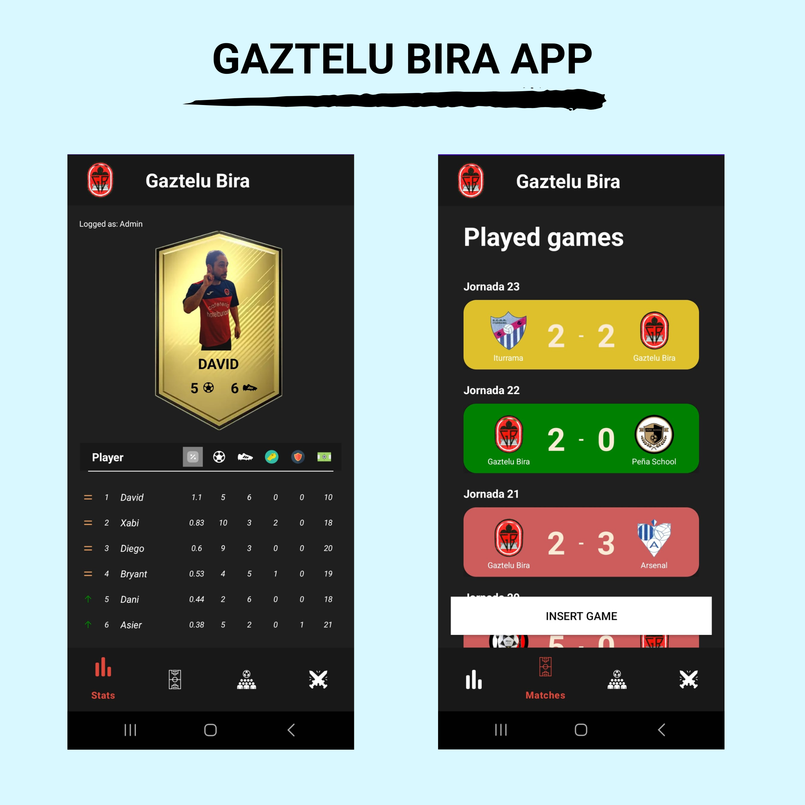

<h1 align="center">Gaztelu Bira App</h1>

   

This is just an app that measures stats and matches played by a local team in Pamplona, Navarra (Spain). 
The main purpose of the app is to gain experience using Android Studio in the Kotlin programming language.

    

## Download
Go to the [Releases](https://github.com/sgaleraalq/GazteluBira/releases) to download the latest APK.

# Tech stack & Open-source libraries
- Minimum SDK level 24
- [Kotlin](https://kotlinlang.org/) based, [Coroutines](https://github.com/Kotlin/kotlinx.coroutines) + [Flow](https://kotlin.github.io/kotlinx.coroutines/kotlinx-coroutines-core/kotlinx.coroutines.flow/) for asynchronous.
- ViewModel: Manages UI-related data holder and lifecycle aware. Allows data to survive configuration changes such as screen rotations.
- DataBinding: Binds UI components in your layouts to data sources in your app using a declarative format rather than programmatically.
- Architecture
  - MVVM Architecture (View - DataBinding - ViewModel - Model)
- [Glide](https://github.com/bumptech/glide), [GlidePalette](https://github.com/florent37/GlidePalette): Loading images from network.
- [Firebase](https://firebase.google.com/): Firebase is a platform developed by Google for creating mobile and web applications.
- [Navigation Component](https://developer.android.com/guide/navigation): Component that helps to implement navigation, from simple button clicks to more complex patterns, such as app bars and the navigation drawer.
- Custom Views
  - [ProgressView](https://github.com/skydoves/progressview): A polished and flexible ProgressView, fully customizable with animations.

## Features
The app contains 4 different screens based upon the player's stats and matches played by the team.

Data is added manually to Firebase Firestore, and the app retrieves it from there following MVVM architecture.

### Screen 1
- Shows the player's stats.
- 
